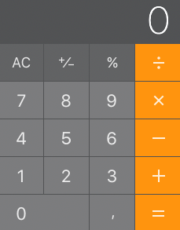

# Innlevering 2

## Oppgave 1

Lag en vitsemaskin. Brukeren trykker på en knapp, og det vises en tilfeldig vits på skjermen.

#### Vurderingskriterier

* Skriv pseudokode (s139)
* Siden skal validere uten feil og advarsler i konsollvinduet.
* Programmet skal vise minst fem ulike vitser.
* Det skal komme klart frem av koden hvordan du har løst problemet.

#### Kompetansemål

* utvikle og sette sammen delprogrammer
* lese og bruke dokumentasjon og kode
* definere variabler og velge hensiktsmessige datatyper
* tilordne uttrykk til variabler
* programmere med enkle og indekserte variabler eller andre kolleksjoner av variabler
* lage egne og bruke egne og andres funksjoner eller metoder med parametere

## Oppgave 2

Lag et program som foretar en lottotrekning. For hver gang brukeren trykker på en knapp skal det trekkes et nytt tall. Dette skjer helt til det er trukket syv tall. Lottorekka skal vises på skjermen med store fargerike tall.

En lottorekke består av syv unike tilfeldige tall mellom 1 og 34.

#### Vurderingskriterier

* Det skal lages flytskjema
* Siden skal validere uten feil og advarsler i konsollvinduet.
* Det skal komme klart frem av forklaringen hvordan du har løst problemet.

#### Kompetansemål

* utvikle og sette sammen delprogrammer
* lese og bruke dokumentasjon og kode
* definere variabler og velge hensiktsmessige datatyper
* tilordne uttrykk til variabler
* programmere med enkle og indekserte variabler eller andre kolleksjoner av variabler

## Oppgave 3

**Enkel**
Lag en enkel kalkulator med to inputfelt, fire knapper og ett felt der svaret skrives ut. Knappene representerer de fire regneartene pluss, minus, gange og dele. Når man skriver inn tall i inputfeltene skal du kunne trykke på en av knappene for å utføre tilhørende operasjon. Resultatet skal skrives ut på skjermen. Skriv en kort forklaring på om hvordan du har løst oppgaven og legg ved dokumentasjon.

**Vanskelig**
Lag en  kalkulator med et inputfelt, fem knapper og ett felt der svaret skrives ut. Knappene representerer de fire regneartene pluss, minus, gange og dele, og =. Når man skriver inn tall i inputfeltene skal du kunne trykke på en av knappene for å legge til neste tall i operasjonen. Resultatet skal skrives ut på skjermen når man trykker på =. Skriv en kort forklaring på om hvordan du har løst oppgaven og legg ved dokumentasjon.

**Veldig vanskelig**
Lag en  kalkulator med et felt for input/svar, og kanpper som representerer tallene fra 0-9 og de fire regneartene pluss, minus, gange og dele. Programmet skal fungere som en kalkulator på maskinen din. Skriv en kort forklaring på om hvordan du har løst oppgaven og legg ved dokumentasjon.

#### Vurderingskriterier

* Siden skal validere uten feil og advarsler i konsollvinduet.
* Programmet skal utføre de fire regneartene og skrive ut resultatet på skjermen.
* Det skal komme klart frem av forklaringen hvordan du har løst problemet.
* Lag dokumentasjon jsDoc

#### Kompetansemål

* utvikle og sette sammen delprogrammer
* lese og bruke dokumentasjon og kode
* definere variabler og velge hensiktsmessige datatyper
* tilordne uttrykk til variabler
* programmere med enkle og indekserte variabler eller andre kolleksjoner av variabler
* lage egne og bruke egne og andres funksjoner eller metoder med parametere